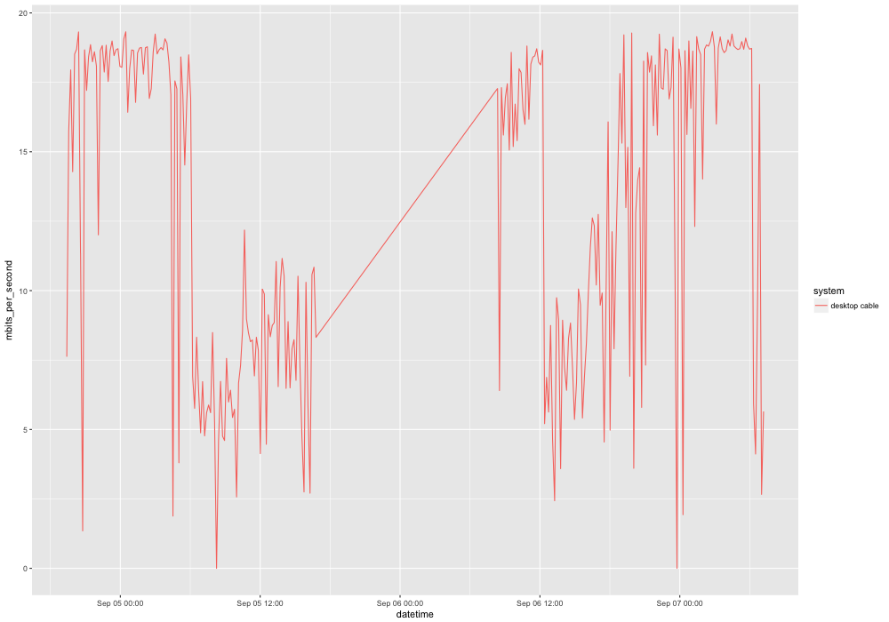
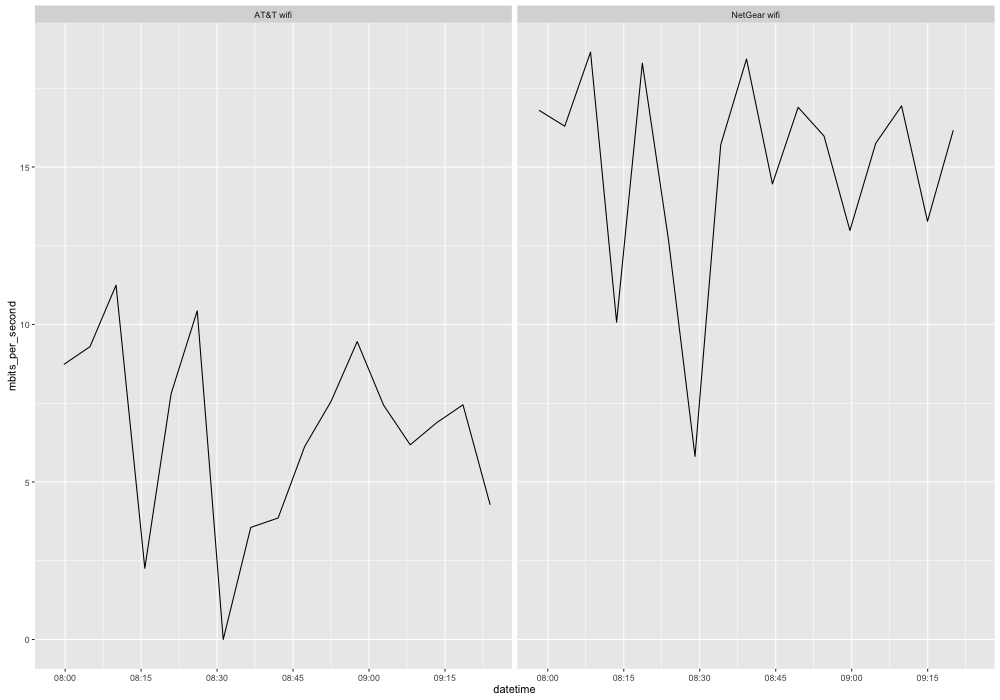

# speedtest-csv
Run a speedtest CLI in the background and record average download speed to a CSV. Use R to plot the values.

This was used for a one-off troubleshooting of a home internet connection. It seemed like AT&T U-Verse was providing lower than the promised 18Mbps. The measurements of a desktop connected by cable directly to the router countered that. The laptop on wifi was slower. The further the laptop was from the wifi, the slower, with the office area being the slowest.

The included CSV files, R script and plots are therefore set up to compare two systems.

## Dependencies

  - Mac OS X or unix, with moreutils package installed
  - R

## How to

Clone the repo. From the working directory, run speedtest.sh.

> ./speedtest.sh

Every 5 minutes it downloads a 10MB file from speedtest.net and updates speedtest.csv with the timestamp and average download speed (in bytes per second)

To graph comparisons using the included R script, either copy to files or modify speedtest.R. It expects speedtest-desktop-dable.csv and speedtest-laptop-wifi.csv.

> Rscript speedtest.R 

It outputs 3 png files:  
  1. speedtest.png   
  2. speedtest-side-by-side.png   
  3. speedtest-boxplot.png   

Of course a spreadsheet could also be used.

Approximate times when the laptop was near the wifi router (tracked manually and not merged into the data or denoted in graphs):  
  
  1. July 1, 7:23 - 9:17 and 14:30 - 17:04  
  2. July 2, 7:25 - 19:57  
  3. July 2 20:52 - July 3 9:23  